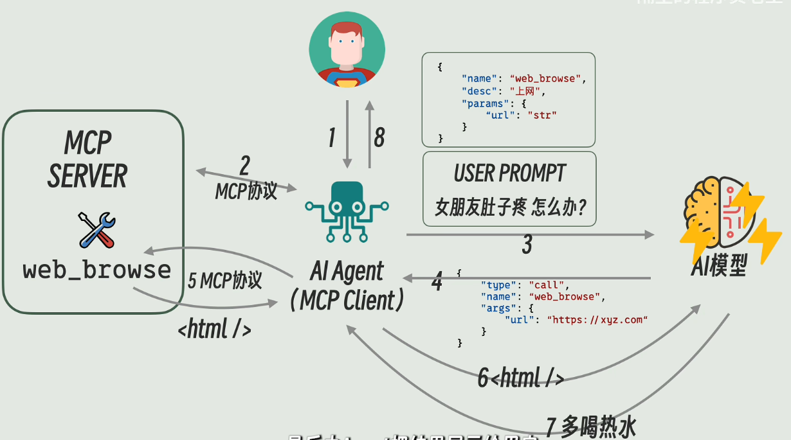

## MCP协议以及其中的客户端和服务器


首先附上[up](https://www.bilibili.com/video/BV19RJhzyEWN?vd_source=4b631e2ab7455b6a8b090e85479e5ca5)画的对我启发极大的一张图片。这张图片中讲了各大部件之间的关系。

从MCP协议为起点，MCP（Model Context Protocol），即模型上下文协议，正是这样一个旨在解决大型语言模型（LLM）与外部世界交互问题的开放标准。

MCP采用**客户端-服务器（Client-Server）**架构模式：

- Host（主机）/LLM 应用： 代表大型语言模型应用程序，例如Claude Desktop、Cursor等，它们是发起连接的一方。

- Client（客户端）： 在Host应用程序内部负责与MCP服务器建立连接，其实可以理解成Agent与MCP协议的集合。

MCP Server（MCP服务器）： 这是MCP系统中最关键的环节。它是一个程序，提供工具和数据访问能力供LLM使用。MCP服务器可以作为本地应用运行在用户设备上，也可以部署到远程服务器。每个MCP服务器都提供一组特定的**工具**（Tools）、**资源**（Resources）和**提示**（Prompts）：

```
1. 工具（Tools）： 供AI模型调用的函数或操作，例如查询数据库、发送邮件、执行代码等。在面对一些没有提供程序接口的软件的时候，可以考虑写一些Py脚本或者命令行工具来实现我们的需求，例如打开项目文件，修改模型参数，运行仿真，提取仿真结果等。另外一种方式，时可以选择一些自动化的GUI库，这样的话就需要很多OCR的token了
2. 资源（Resources）： 供用户或AI模型使用的上下文和数据，例如API回复、文件内容等。
3. 提示（Prompts）： 用于完成特定任务的预定义提示模板。
当LLM需要获取信息或执行操作时，它会通过MCP客户端向MCP服务器发送请求。MCP服务器会与相应的外部数据源或工具进行交互，获取数据并按照MCP协议规范进行格式化，最后将格式化后的数据返回给LLM。
```
---
回到上图，由于这个协议是用来规范Agent和各种tools之间的通信，调用格式规范的，由此可以将客户端的开发与服务器的开发分离开。因此开发可以分成三个大部分，


## 大模型部分的工作与RAG架构
第一个部分是大模型部分，包括微调、如何设计一个专用模型，如何减少幻觉、目前的RAG架构如何进行优化等等工作。

简单介绍一下RAG架构


想象一下，LLM就像一个博览群书但只活在“过去”的人（因为它的知识截止于训练数据）。RAG给它配了一个“实时图书馆管理员”和一套“搜索工具”。

### RAG核心思路：

当用户提出一个问题时，RAG不是直接让LLM回答，而是分两步走：

1.  **检索 (Retrieval)：** 从一个外部知识库（你的“实时图书馆”）中找出与用户问题最相关的几段信息。
2.  **增强生成 (Augmented Generation)：** 将这些检索到的信息和用户的问题一起喂给LLM，让LLM基于这些“上下文”来生成答案。

### RAG架构详解与举例：

假设你正在研究一个新的相控阵天线设计，并且你有一个内部的技术文档库，里面包含了最新的天线设计规范、材料特性和仿真结果。

**用户问题：** "最新的MIMO相控阵天线设计中，氮化镓（GaN）材料的关键优势是什么？"

#### **第一步：知识库准备 (提前进行)**

这是RAG的基础，你需要把你的“实时图书馆”整理好。

1.  **文档收集：** 收集所有相关的技术文档、研究论文、设计规范等。
2.  **Chunking (分块)：**
    * **概念：** 大文档被分割成更小的、有意义的文本片段，称为“Chunk”（块）。
    * **目的：** LLM的输入有长度限制（上下文窗口），而且太大的块会稀释关键信息。把文档切成小块，可以更精准地检索。
    * **举例：** 你的一篇关于GaN材料特性的长论文，会被切分成多个Chunk，例如：
        * **Chunk 1:** "GaN在射频（RF）应用中的基本特性和历史..."
        * **Chunk 2:** "GaN在MIMO相控阵天线中的功率密度和效率优势..."
        * **Chunk 3:** "GaN与其他半导体材料（如GaAs）的对比..."
        * **Chunk 4:** "GaN器件的散热挑战和解决方案..."
    * **切分策略：** 可以按句子、段落、固定长度（带重叠）等方式切分。对于技术文档，考虑语义完整性很重要。
3.  **Embedding (嵌入)：**
    * **概念：** 将每个文本Chunk转换成一个高维的数字向量（一串数字），这个向量能够捕捉Chunk的语义信息。语义相似的Chunk，它们的Embedding向量在向量空间中也会靠得很近。
    * **技术：** 使用专门的Embedding模型（例如OpenAI的text-embedding-ada-002，或者开源的BERT、Sentence-BERT等模型）来完成。
    * **举例：**
        * Chunk 1的Embedding向量：$[0.1, -0.5, 0.3, ..., 0.8]$
        * Chunk 2的Embedding向量：$[0.15, -0.48, 0.32, ..., 0.79]$ (与Chunk 1在向量空间中距离较近，因为都与GaN相关)
        * Chunk 3的Embedding向量：$[0.6, 0.2, -0.1, ..., 0.9]$ (与前两个距离较远，主题不同)
    * **存储：** 这些Embedding向量会被存储在一个向量数据库（Vector Database，如Pinecone, Weaviate, Milvus, ChromaDB等）中，以便快速检索。

#### **第二步：实时查询 (当用户提问时)**

1.  **用户问题Embedding：**
    * 当用户提出问题 "最新的MIMO相控阵天线设计中，氮化镓（GaN）材料的关键优势是什么？" 时，首先会使用**与Chunk Embedding相同的Embedding模型**将这个问题也转换成一个Embedding向量。
    * **举例：** 问题的Embedding向量：$[0.12, -0.51, 0.31, ..., 0.81]$

2.  **向量相似度搜索 (Retrieval)：**
    * 将用户问题的Embedding向量与向量数据库中所有Chunk的Embedding向量进行比较。
    * 寻找**语义上最相似**的Chunk（即向量距离最近的Chunk）。
    * **举例：** 向量数据库会找出 Chunk 2 ("GaN在MIMO相控阵天线中的功率密度和效率优势...") 和其他几个与GaN或MIMO相关的Chunk，因为它们的向量与问题向量距离最近。通常会检索Top-K个（比如Top-3或Top-5）最相关的Chunk。

3.  **增强生成 (Augmented Generation)：**
    * 将检索到的相关Chunk的原文内容（不是Embedding向量）和用户的问题一起打包成一个Prompt，发送给LLM。
    * **Prompt结构示例：**
        ```
        请根据以下提供的信息，回答用户的问题：

        ---
        信息1：[Chunk 2 的原文内容] "GaN在MIMO相控阵天线中的功率密度和效率优势使其成为关键材料。其高击穿电压和电子迁移率，使得GaN器件能够工作在更高的频率和功率水平，从而实现更紧凑、更高性能的天线模块..."

        信息2：[Chunk 5 的原文内容] "此外，GaN在高温下的稳定性也优于其他半导体材料，这对于MIMO天线在高功率运行时的散热设计至关重要..."
        ---

        用户问题：最新的MIMO相控阵天线设计中，氮化镓（GaN）材料的关键优势是什么？
        ```
    * LLM接收到这个“增强”后的Prompt，它现在不仅有自己原有的知识，还有了来自外部知识库的最新、最具体的信息。
    * LLM结合这些信息进行理解、推理和生成，给出更准确、更专业的答案。

**LLM的最终回答：** "在最新的MIMO相控阵天线设计中，氮化镓（GaN）材料的关键优势体现在其**高功率密度、高效率以及在高温下的卓越稳定性**。GaN的高击穿电压和电子迁移率使其能在更高频率和功率水平下运行，从而实现更紧凑、高性能的天线模块。此外，其优异的热稳定性对高功率MIMO天线的散热设计至关重要。"

但是就像我之前读过的一个知乎大佬所写的[文章](https://zhuanlan.zhihu.com/p/5851457581)所说的，**能不自己部署模型，就不自己部署。 自己部署的硬件成本和维护成本，对于小团队来说，很可能是压垮骆驼的一座大山。**


## Agent开发
第二个是Agent的开发部分，也就是客户端部分，关于这部分已经写过一些内容了。

这里还应该注意的是，由于MCP协议，其实不需要关注agent输入与输出的设计，只需要根据不同的业务场景选择，Agent的输出究竟选择JSON格式还是选择使用Prompt格式即可，如何设计Prompt也就成了重点。


## 服务器部分
第三个是服务器部分，未来会在这个方向做一些探索。

这里包含很多的部分，像Tools的设计，也就是如何根据业务场景写一个函数的库来供Agent进行调用。另外在写库函数时要格外注意docstr的书写，函数变量的命名，这里其实和Prompt设计有异曲同工之妙了。

---

最后，一些思考。关于整套架构，其中的工具设计是比较容易做到的（除了大模型部分的算法部分），但是如何为MCP的落地提供应用场景就成了难事，巨大的token耗费成本极大的限制了应用场景，如何落地呢？