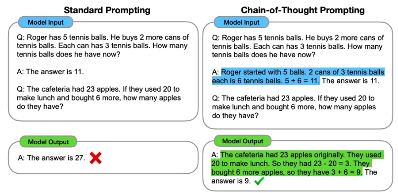
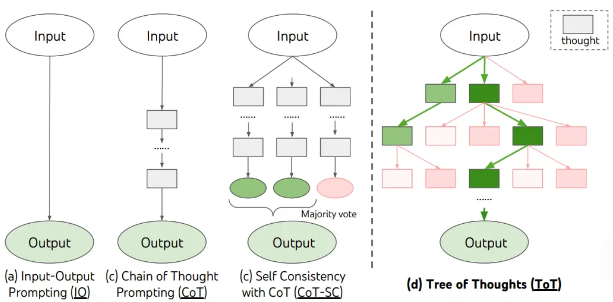
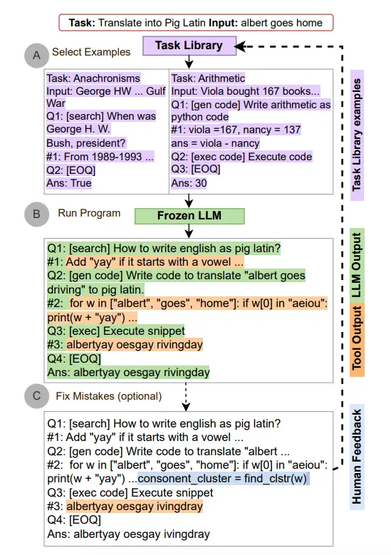

### 零样本提示
提示
```
将文本分类成中性、负面或正面
文本：我认为这次假期还可以
情感：
```
输出
```
中性
```
指令调整已被证明可以改善零样本学习Wei等人（2022）。指令调整本质上是在通过指令描述的数据集上微调模型的概念。此外，RLHF（来自人类反馈的强化学习）已被采用以扩展指令调整，其中模型被调整以更好地适应人类偏好。这一最新发展推动了像ChatGPT这样的模型。我们将在接下来的章节中讨论所有这些方法和方法。

### 少样本提示
即在prompt中给出一个实例，来帮助模型进行理解
```
这太棒了！// Negative
这太糟糕了！// Positive
哇，那部电影太棒了！// Positive
多么可怕的节目！//
```
```
Negative
```

### COT

- 关于零样本COT：即在后面加入"让我们逐步思考"
- 自动思维链（Auto-Cot），即利用 LLMs “让我们一步一步地思考” 提示来生成一个接一个的推理链。这种自动过程仍然可能在生成的链中出现错误。为了减轻错误的影响，演示的多样性很重要。
1. 一般首先要先将任务分解成为不同的、连续的步骤
2. 使用XML来构建清晰的交接
3. 对每个任务要求构建清晰的目标
4. 要根据模型的表现进行Prompt的迭代


### 自我一致性
自我一致性旨在“替换链式思维提示中使用的天真贪婪解码方法”。其想法是通过少样本 CoT 采样多个不同的推理路径，并使用生成结果选择最一致的答案。这有助于提高 CoT 提示在涉及算术和常识推理的任务中的性能。
其实本质上是设计相同范式的问题与解答，帮助模型建立一致性
> - Q：林中有15棵树。林业工人今天将在林中种树。完成后，将有21棵树。林业工人今天种了多少棵树？
> - A：我们从15棵树开始。后来我们有21棵树。差异必须是他们种树的数量。因此，他们必须种了21-15 = 6棵树。答案是6。
> - Q：停车场有3辆汽车，又来了2辆汽车，停车场有多少辆汽车？
> - A：停车场已经有3辆汽车。又来了2辆。现在有3 + 2 = 5辆汽车。答案是5。
> - ....
> - 当我6岁时，我的妹妹是我的一半年龄。现在我70岁了，我的妹妹多大？

### TOT

TOT本质上是将思考过程建模成一个多步，分支的思考树。每个节点都是一个思考过程。
可以通过合理设计Prompt来实现TOT的结构。目前较为流行的TOT结构包括基于深度搜索、广度搜索等策略的。另一种基于强化学习训练出的TOT训练器。
```
假设三位不同的专家来回答这个问题。
所有专家都写下他们思考这个问题的第一个步骤，然后与大家分享。
然后，所有专家都写下他们思考的下一个步骤并分享。
以此类推，直到所有专家写完他们思考的所有步骤。
只要大家发现有专家的步骤出错了，就让这位专家离开。
请问...
```
---
如何将TOT应用于模型的建构中是下一步要了解的方向
---

### 自动推理并使用工具（ART）
是在2023年提出的一个新的框架，这个框架使用冻结的LLM来自动生成包含中间推理步骤的程序
>1. 在接到新的任务的时候，从任务库中选择多部推理和使用工具的示范
>2. 在测试中，调用外部工具，先暂停生成，将工具整合后继续生成



---
就目前所了解到的，基本的Prompt设计主要还是基于普通的设计，或加入一些思维链提示链等。另外还有一部分为了提高泛化性能，使用了LLM来生成prompt进而生成答案，