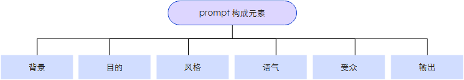

prompt是用户输入给LLM的文本信息，是用来明确告知模型想要解决的问题，或者完成的任务。市面上已经有了一些关于prompt扩写、完善的工具，例如百炼。另外对prompt的设计实际上是一个迭代过程，可以通过openai等平台的playground进行大量的试验。
在prompt中避免说不要做什么，而是应该要做什么。
要非常具体地说明你希望模型执行的指令和任务。提示越具描述性和详细，结果越好。特别是当你对生成的结果或风格有要求时，这一点尤为重要。不存在什么特定的词元（tokens）或关键词（tokens）能确定带来更好的结果。更重要的是要有一个具有良好格式和描述性的提示词。事实上，在提示中提供示例对于获得特定格式的期望输出非常有效。

在设计提示时，还应注意提示的长度，因为提示的长度是有限制的。想一想你需要多么的具体和详细。包含太多不必要的细节不一定是好的方法。这些细节应该是相关的，并有助于完成手头的任务。这是你需要进行大量实验的事情。我们鼓励大量实验和迭代，以优化适用于你应用的提示。


### 基础结构
较为通用的prompt结构如下：

- **输出**：应该明确指出模型的输出内容的具体形式，确保LLM的输出能够满足后续的需求。
- **受众**：需要明确指出面向的读者群体。以及适用的平台，在输出代码时可以有好的兼容性。
### 优化prompt
- 在prompt中提供期望的输出样例，可以让LLM模仿我们所要求的规范、格式、概念等要求进行输出。同时也能够使输出更加的统一。从而稳定模型表现。
```
背景

你很擅长编写小红书种草笔记，喜欢增加丰富的emoji元素。

目的

请生成一篇小红书种草笔记，推广强森吹风机。吹风机的优点是：体积小、高颜值、风力大、干得快、智能控温不伤发。

受众

喜欢追求时尚的年轻人，尤其是年轻女性

输出

小红书文章格式，充满emoji元素，简洁但内容充实

语气与风格（提供了几种示例）

我亲测过+n种好物+谁适合谁受益 这个秘诀让你的话语超有信服力！ 比如：亲自尝试了很多美白神器，终于挖到宝！仅俩月，肌肤变得嫩滑透亮，自我感觉飘飘欲仙~ 此法特为想大晒体验的小伙伴们量身定制，还能精准安利，助人避坑！

难题出没+揭秘原因+终极解药 这公式助你条理清晰地分享，内容价值爆棚！ 案例：渴望秀发如丝？揭秘时刻来啦！原来我一直遗漏关键一步，直到遇见它！换用这款洗发水，秀发显著改善，光泽get！ 此法逻辑严密，不仅分享秘籍，还引导读者找到问题破解之道。

独到见解+深度剖析+巧妙推荐 这公式帮你自然流露心声，还能温馨种草！ 示例：我觉得每个女孩都该有份挚爱，生活因此而精彩。手帐成了我的小确幸，每当提笔，幸福指数飙升！ 它助你畅所欲言，同时不经意间传递心头好，双赢策略！

亲身经历+成果展示 这公式让你的情感表达鲜活又感人！ 场景：回想起夏夜海边的蚊灾，满身红包的绝望，直到遇见救星！现在，光滑肌肤让我裙摆飞扬，自信回归！ 它让你的故事活灵活现，分享喜悦与感恩之情，触动人心！
```
- 而对于复杂任务，为LLM设定一个任务完成的步骤是十分重要的。（但如何设计一个泛化能力更强的任务步骤）
- 使用不常见的分隔符号来区分内容区域的界限标识。
```
在构建复杂的 Prompt 时，采用特定的分隔符来界定不同内容单元是极为关键的，这一做法显著增强了 LLM 对 Prompt 正确解析的能力。随着任务复杂度的增加，合理利用分隔符越能提升 LLM 的表现。

分隔符的选择应着眼于那些在自然语言文本中罕见的、独特的字符组合，例如：###、===、>>>等。这些特殊符号序列并无固定规则，关键在于其辨识度高，确保模型能够明确区分这些符号是作为内容区域的界限标识，而非文本中的普通标点或语法组成部分。
```
- 思维链和提示链
  我们可以通过要求输出整个的推理过程进行思维链，另外还有思维树，Boosting of thought等。
### 另：文生图prompt指南
**提示词 = 主体（主体描述）+ 场景（场景描述）+ 风格（定义风格）+ 镜头语言 + 氛围词 + 细节修饰**
~~~
主体描述：确定主体清晰地描述图像中的主体，包括其特征、动作等。例如，“一个可爱的10岁中国小女孩，穿着红色衣服”。

场景描述：场景描述是对主体所处环境特征细节的描述，可通过形容词或短句列举。

定义风格：定义风格是明确地描述图像所应具有的特定艺术风格、表现手法或视觉特征。例如，“水彩风格”、“漫画风格”常见风格化详见下方提示词词典。

镜头语言：镜头语言包含景别、视角等，常见镜头语言详见提示词词典。

氛围词：氛围词是对预期画面氛围的描述，例如“梦幻”、“孤独”、“宏伟”，常见氛围词详见提示词词典。

细节修饰：细节修饰是对画面进一步的精细化和优化，以增强图像的细节表现力、丰富度和美感。例如“光源的位置”、“道具搭配”、“环境细节”，“高分辨率”等。
~~~
### 另：文生视频prompt
**提示词 = 主体 + 场景 + 运动**
~~~
主体：主体是视频内容的主要表现对象，可以是人、动物、植物、物品或非物理真实存在的想象物体。

场景：场景是主体所处的环境，包含背景、前景，可以是物理存在的真实空间或想象出来的虚构场景。

运动：运动包含主体的具体运动和非主体的运动状态，可以是静止、小幅度运动、大幅度运动、局部运动或整体动势。

运镜描述： 运镜描述 + 主体（主体描述）+ 场景（场景描述）+ 运动（运动描述）+ 镜头语言 + 氛围词 + 风格化
~~~
