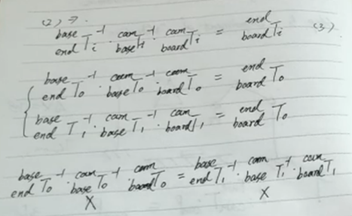

## **手眼标定**
分为两种情况，眼在手外与眼在手上
手眼标定的目标是获得相机坐标系到机器人的基坐标系变换矩阵

对于基矩阵到摄像头矩阵，首先选取标定板的三个基向量拼接成为R矩阵。然后以标定板原点的坐标为t。
最后为了防止标定板的xy向量不正交，最好在xz方向重新叉乘得到新的y向量，以此提升精度
在选取标定板基向量时选取较远的起点与中点较为准确

将标定板放置在机械臂的末端法兰上，而这个矩阵是较为难以估计的，想办法消除
左乘基坐标到摄像头矩阵的逆，左乘法兰到基坐标的矩阵的逆
多次照相并联立方程

