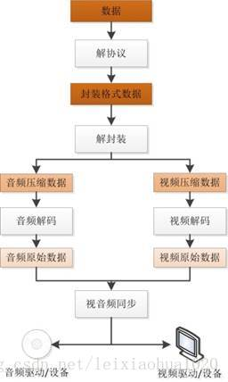
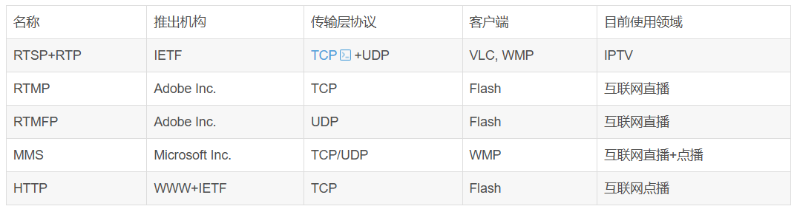
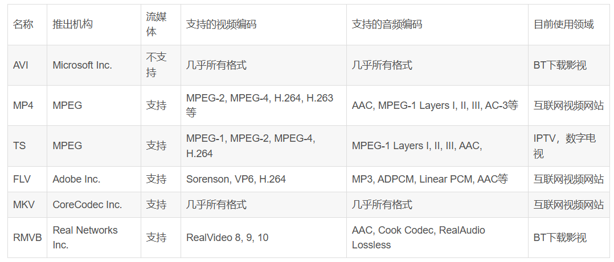
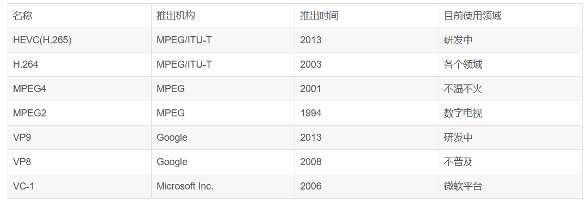
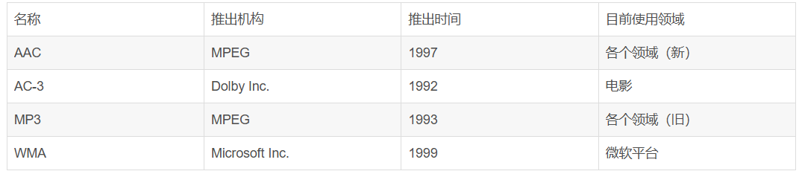
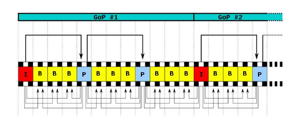

刚刚开始学习音视频相关的知识，在搜索学习资料的时候发现这个方向做的最多开源的是一位博士生雷霄骅。但是雷博士已经去世，这里表达敬意。文章记录从雷神的博客中自己理解的知识，其中有摘抄的博客内容


# 视频播放器原理

## 视频播放器拓扑结构

```
解协议的作用，就是将流媒体协议的数据，解析为标准的相应的封装格式数据。视音频在网络上传播的时候，常常采用各种流媒体协议，例如HTTP，RTMP，或是MMS等等。这些协议在传输视音频数据的同时，也会传输一些信令数据。这些信令数据包括对播放的控制（播放，暂停，停止），或者对网络状态的描述等。解协议的过程中会去除掉信令数据而只保留视音频数据。例如，采用RTMP协议传输的数据，经过解协议操作后，输出FLV格式的数据。

解封装的作用，就是将输入的封装格式的数据，分离成为音频流压缩编码数据和视频流压缩编码数据。封装格式种类很多，例如MP4，MKV，RMVB，TS，FLV，AVI等等，它的作用就是将已经压缩编码的视频数据和音频数据按照一定的格式放到一起。例如，FLV格式的数据，经过解封装操作后，输出H.264编码的视频码流和AAC编码的音频码流。

解码的作用，就是将视频/音频压缩编码数据，解码成为非压缩的视频/音频原始数据。音频的压缩编码标准包含AAC，MP3，AC-3等等，视频的压缩编码标准则包含H.264，MPEG2，VC-1等等。解码是整个系统中最重要也是最复杂的一个环节。通过解码，压缩编码的视频数据输出成为非压缩的颜色数据，例如YUV420P，RGB等等；压缩编码的音频数据输出成为非压缩的音频抽样数据，例如PCM数据。

视音频同步的作用，就是根据解封装模块处理过程中获取到的参数信息，同步解码出来的视频和音频数据，并将视频音频数据送至系统的显卡和声卡播放出来。
```

## 流媒体协议




## 封装格式


## 视频编码


## 音频编码



| 名称 | 推出机构 | 推出时间 | 目前使用领域 |
| :--- | :--- | :--- | :--- |
| LDAC | Sony Corporation | 2015 | 高分辨率无线音频传输，主要应用于索尼耳机/播放器与安卓设备之间（需要设备支持） |

**关于LDAC的补充说明：**

* **高分辨率音频传输：** LDAC是索尼开发的一种音频编码技术，旨在通过蓝牙连接传输高分辨率（Hi-Res Audio）音频。它能够传输比传统蓝牙编解码器（如SBC）更高码率的数据，从而在无线传输中保留更多的音频细节。
* **码率：** LDAC支持多种传输码率，最高可达990 kbps（在最佳连接条件下），这远高于SBC（最高约328 kbps）和aptX HD（576 kbps）。
* **应用场景：** 主要用于索尼自家的音频产品（如WH-1000XM系列耳机、Walkman播放器）以及支持LDAC的安卓智能手机。它是安卓8.0（Oreo）及更高版本系统中的一个标准蓝牙音频编解码器。
* **局限性：** 尽管LDAC能够传输高码率音频，但其传输质量受限于蓝牙连接的稳定性。在复杂的无线环境下，码率可能会自适应下降以维持连接。此外，其使用范围主要集中在索尼和安卓生态系统内，苹果iOS设备目前不支持LDAC。
* **与传统编码器的区别：** 与你表格中列出的AAC、MP3、AC-3、WMA等主要用于音频文件存储和流媒体分发的编码器不同，LDAC更侧重于**无线传输**过程中的高质量编码，尤其是在蓝牙这个带宽有限的载体上。AAC、MP3等通常是音频文件的**格式**，而LDAC是**传输协议**的一部分，用于将这些格式的音频数据通过蓝牙高效传输。


# 什么是RTSP（流媒体协议）
## RTSP的组成
RTSP是一个实时的传输协议，是一个应用层的协议，包RTSP协议，RTP协议，RTCP协议。
- RTSP协议主要是负责建立服务器和客户端之间的请求和相应，建立通信链路。
- RTP协议是负责在服务器和客户端进行传输数据，
- RTCP协议四负责提供RTP传输质量的反馈，确保RTP传输的质量。

三者的关系：RTSP不会发送媒体数据，知识完成服务器和客户端之间的信令交互，RTP协议负责媒体数据传输，RTCP负责RTP数据包的监视和反馈，RTP和RTCP并没有规定传输层的类型，可以选择UDP或者是TCP，RTSP则要求是基于TCP。总体来说，RTSP是建立在RTP和RTCP之上的。

## RTSP的过程
一次基本的RTSP操作过程是，首先，客户端线连接到流媒体服务器，并发送i个（DESCRIBE）。流服务器通过一个SDP描述来进行反馈，反馈信息包括流数量，媒体类型等信息，客户端在分析描述符后 ,并为每个流发送SETUP命令，这个命令来告诉服务器，客户端用于接收媒体数据的端口，流媒体连接建立完成后，客户端发送i个播放命令PLAY服务器就可以在UDP上传送媒体流，RTP包到客户端，在播放过程中客户端还可进行快进，快退，等操作。

## RTSP与HTTP的关系

1.  RTSP引入了几种新的方法，比如DESCRIBE、PLAY、SETUP 等，并且有不同的协议标识符，RTSP为rtsp 1.0,HTTP为http 1.1；

2.  HTTP是无状态的协议，而RTSP为每个会话保持状态；

3.  RTSP协议的客户端和服务器端都可以发送Request请求，而在HTTPF协议中，只有客户端能发送Request请求。

4.  在RTSP协议中，载荷数据一般是通过带外方式来传送的(除了交织的情况)，及通过RTP协议在不同的通道中来传送载荷数据。而HTTP协议的载荷数据都是通过带内方式传送的，比如请求的网页数据是在回应的消息体中携带的。

5.  使用ISO10646(UTF-8) 而不是ISO 8859-1，以配合当前HTML的国际化；

6.  RTSP使用URI请求时包含绝对URI。而由于历史原因造成的向后兼容性问题，HTTP/1.1只在请求中包含绝对路径，把主机名放入单独的标题域中；
## RTSP协议格式
[文章](https://blog.csdn.net/leixiaohua1020/article/details/11955341)

在client和server的连接中，还需要使用SDP描述符，连接中有关于SDP的协议说明。

# TS封装或者FLV封装

# 编码
## 视频帧内编码
视频编码词用压缩技术来减少码率，而压缩的理论依据主要来源于：
1. 数据冗余，通过关联图像中的各像素，来实现无损压缩
2. 视觉冗余，在人眼的可分辨范围外通过引入客观失真来实现有损压缩。

变换编码：首先将源图像切割，然后对切割后的小块进行DCT变换，这个小块叫做**宏块**，在对图像块经过DCT变换后的系数进行量化，在传送过程中只传递一部分数据。实现有损压缩。实现有损压缩。

## 视频帧间编码
采用运动估计和运动补偿的方法来实现，第一步还是实现图像分割，然后在前一图像或者后抑恶图像某个搜索窗口的范围内未每一一个图像块寻找最为相似的图像块，通过计算这两个图像块的变换关系得到运动矢量。将两个图像块相减得到残差图像。前一个过程叫做运动估计，后一个过程叫做运动补偿。

## 编码器算法
视频编码器能够自主的比较帧内预测和帧间预测的结果，选择出最佳结果，即**模式选择**。并且编码器应该对每个宏块能做出如下处理：
>1. 后向预测（使用未来的帧）
>2. 前向预测（使用过去的帧）
>3. 无帧间预测，仅帧内预测
>4. 完全跳过（帧内或帧间预测）

同时为了提高视频压缩质量，引入I帧、P帧、B帧。

I帧只使用本帧内数据编码，不需要考虑消除时间序列相关性。P帧使用前面的I帧或P帧来做运动估计和补偿。B帧使用前面的一个I帧或P帧，或后面一个I帧或P帧；来进行预测。使用B帧可以实现高压缩比。但是如果P帧和参考B帧遭到破坏，其他所有依赖于它们的帧就不能完整解码，这会直接导致视频故障。视频通常无法从此类问题中恢复。然而，当被破坏的视频流到达I帧，因为I帧被独立地编码解码，所以视频问题可以从I帧恢复。

在H264中图像以序列为单位进行组织，一个序列是一段图像编码后的数据流。

一个序列的第一个图像叫做IDR 图像（立即刷新图像），IDR 图像都是 I 帧图像。H.264 引入 IDR 图像是为了解码的重同步，当解码器解码到 IDR 图像时，立即将参考帧队列清空，将已解码的数据全部输出或抛弃，重新查找参数集，开始一个新的序列。这样，如果前一个序列出现重大错误，在这里可以获得重新同步的机会。IDR图像之后的图像永远不会使用IDR之前的图像的数据来解码。

一个序列就是一段内容差异不太大的图像编码后生成的一串数据流。当运动变化比较少时，一个序列可以很长，因为运动变化少就代表图像画面的内容变动很小，所以就可以编一个I帧，然后一直P帧、B帧了。当运动变化多时，可能一个序列就比较短了，比如就包含一个I帧和3、4个P帧。

在视频编码序列中，GOP即Group of picture（图像组），指两个I帧之间的距离，Reference（参考周期）指两个P帧之间的距离。两个I帧之间形成一组图片，就是GOP。




> 下面重点解释一下B帧预测的逻辑。


我们用一个简化的模型来描述 B 帧的预测过程。假设我们有一个 GOP 结构，例如：`I B B P B B I`。

当编码器处理某个 B 帧时，例如，在 `P1` 和 `P2` 之间的 `B1` 帧：
`P1 ---> B1 <--- P2`

B帧的预测通常涉及以下步骤：

1.  **确定参考帧列表 (Reference Picture Lists)：**
    * 每个 B 帧在编码时会维护两个参考帧列表：
        * **List 0 (L0)：** 包含在其**显示时间戳之前**的参考帧（通常是 I 或 P 帧）。
        * **List 1 (L1)：** 包含在其**显示时间戳之后**的参考帧（通常是 I 或 P 帧）。
    * 这些参考帧可以是比当前 B 帧更早或更晚解码的 I/P 帧。例如，对于 `B1`，`P1` 位于 L0，`P2` 位于 L1。

2.  **宏块或子块级别预测：**
    B帧的预测是以宏块（Macroblock，16x16 像素）或更小的子块为单位进行的。对于当前 B 帧中的一个宏块：

    * **a. 向前预测 (Forward Prediction)：**
        * 编码器在 **List 0** 中的参考帧（例如 `P1`）中搜索与当前宏块最相似的区域。
        * 找到最相似的区域后，计算出**运动矢量 (Motion Vector, MV)**，这个 MV 指示了从参考帧中的哪个位置到当前宏块位置的位移。
        * 记录下这个运动矢量和对应的预测残差（当前宏块与向前预测结果的差异）。

    * **b. 向后预测 (Backward Prediction)：**
        * 编码器在 **List 1** 中的参考帧（例如 `P2`）中搜索与当前宏块最相似的区域。
        * 计算出另一个运动矢量 (MV')。
        * 记录下这个运动矢量和对应的预测残差。

    * **c. 双向预测 (Bi-directional Prediction)：**
        * 这是 B 帧特有的强大功能。编码器会尝试结合 **向前预测的结果** 和 **向后预测的结果** 来生成一个更准确的预测。
        * **加权平均：** 最常见的方法是对向前预测和向后预测的结果进行加权平均。例如，如果 `B1` 刚好位于 `P1` 和 `P2` 的中间，可能会对两个预测结果各取 50% 进行叠加。
        * **选择更好的预测模式：** 编码器会比较三种预测模式（向前、向后、双向）产生的预测残差大小，选择残差最小的模式。残差越小，说明预测越准确，需要编码的数据量就越少。

3.  **编码残差和运动信息：**
    * 无论选择哪种预测模式，B 帧最终编码的都是**预测残差**（当前宏块的实际像素值与预测结果之间的差异）以及用于预测的**运动矢量**和**参考帧索引**。
    * 由于预测残差通常包含的能量非常小（因为预测得很准确），所以经过变换、量化和熵编码后，数据量会非常小。

举例说明

假设我们有三帧画面，编码顺序和显示顺序可能如下：

* **显示顺序：** F1 (I) -> F2 (B) -> F3 (P) -> F4 (B) -> F5 (P)
* **解码顺序（为了先解码参考帧）：** F1 (I) -> F3 (P) -> F2 (B) -> F5 (P) -> F4 (B)

我们聚焦在 **F2 (B帧)** 如何编码：

1.  **解码 F1 (I帧)：** F1 是一个完整的独立帧，不依赖其他帧。
2.  **解码 F3 (P帧)：** F3 依赖 F1 进行预测。编码器从 F1 中找到 F3 各个宏块的相似区域，记录下运动矢量和残差。
3.  **解码 F2 (B帧)：**
    * F2 知道它在显示顺序上介于 F1 和 F3 之间。
    * 对于 F2 中的一个宏块：
        * **向前预测：** 编码器在 F1 中找一个最像的块，记录 MV。
        * **向后预测：** 编码器在 F3 中找一个最像的块，记录 MV'。
        * **双向预测：** 将 F1 的预测块和 F3 的预测块进行平均或加权平均，形成一个双向预测块。
    * 编码器会比较这三种方式的预测残差大小。例如，如果 F2 上的一个物体是从 F1 运动到 F3 过程中的中间位置，那么双向预测往往能得到最小的残差。如果 F2 上的一个静止背景在 F1 和 F3 中都有，那么向前或向后预测就足够了。
    * 最终，F2 编码并存储：哪个预测模式、哪个参考帧（L0或L1）、运动矢量、以及实际的预测残差。

## 音频编码

同样在音频方向也包括有损压缩和无损压缩。有损即去掉弱音信号或者去掉人耳听觉范围外的频率（<20Hz||>=20KHz）.

关于音频的采样量化等方法以传统的PCM为例。

常见的无损方法：

>1. FLAC (Free Lossless Audio Codec): 目前最流行的无损音频编码格式，开源、免费。
>2. APE (Monkey's Audio): 另一种流行的无损格式，但解码复杂度较高。
>3. ALAC (Apple Lossless Audio Codec): 苹果开发的无损格式，用于其生态系统。
>4. WavPack (WV): 灵活的混合模式无损格式。
>5. DSD/DSF/DFF: 用于高解析度音频的特殊无损格式，不完全是 PCM 编码。

有损方法较多，后面再详细学习，这里只聊一下AAC。

AAC编码文件格式文件有两种：

ADIF：Audio Data Interchange Format 音频数据交换格式。这种格式的特征是可以确定的找到这个音频数据的开始，不需进行在音频数据流中间开始的解码，即它的解码必须在明确定义的开始处进行。故这种格式常用在磁盘文件中。

ADTS：Audio Data Transport Stream 音频数据传输流。这种格式的特征是它是一个有同步字的比特流，解码可以在这个流中任何位置开始。它的特征类似于mp3数据流格式。这种格式可以用于广播电视。

简言之。ADIF只有一个文件头，ADTS每个包前面有一个文件头。
