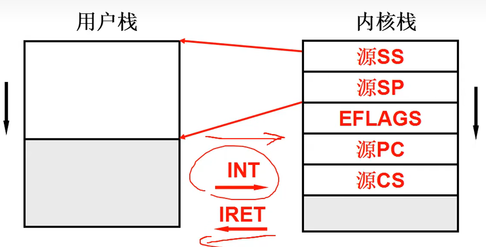

# 一级标题

## 二级标题

### 三级标题

#### 四级标题

##### 五级标题

###### 六级标题


*斜体文字*

_斜体文字_

**粗体文字**

__粗体文字__

***粗斜体文字***

___粗斜体文字___


分割线
***
* * *
******
- - -
------

如果段落上的文字要添加删除线，只需要在文字的两端加上两个波浪线~~即可。
baidu.com
sina.com
~~tencent.com~~

下划线可以通过HTML的标签来实现
<u>带下划线文本</u>

[^要注明的文本]：脚注

* 第一项
* 第二项
* 第三项

+ 第一项
+ 第二项
+ 第三项

- 第一项
- 第二项
- 第三项
1. 第一项
2. 第二项
3. 第三项

> 区块引用
> Markdown教程
> 学的不仅是技术更是梦想

> 区块中使用列表
> 1. 第一项
> 2. 第二项
> + 第一项
> + 第二项
> + 第三项
```json
{
  "firstName": "John",
  "lastName": "Smith",
  "age": 25
}
```
<?Python
    print('Markdown')
    def test():
        print('Markdown test!')
        >

    这是一个链接 [新浪新闻](https://news.sina.com.cn/)
<https://news.sina.com.cn/>


