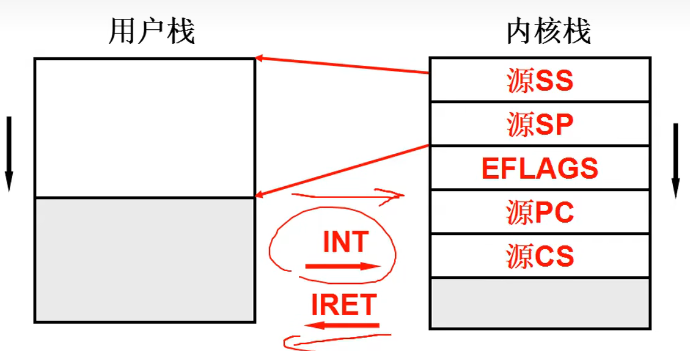

# 关于CPU的工作原理
+ 主要是通过地址总线和内存进行连接，通过设置PC的初值来实现取指令，存指令的循环操作
+ 对于CPU而言，计算指令与IO指令的执行时间比约为百万倍。即引入中断思想，并发概念。
+ 在切换进程的时候，需要记录进程所产生的临时信息，即记录进程信息的存储结构PCB。

# 多进程CPU图像
+ 对于上层用户而言是启动了多个进程同时进行
+ 对于操作系统而言是对于不同进程的分配资源与合理调度
+ 对于CPU而言是指针的切换与地址，暂时数据的记录

+ 依靠schedule（）函数来进行进程调度与切换
+ 如果多个进程同时存在内存当中，很可能会导致进程1运行过程中修改进程二的存储信息，而两个进程的CPL与DOL级别都是3，使得这种情况易于发生。因此要引入多进程的地址空间分离，这是内存管理的主要内容。基本思想是通过映射表。
+ 多进程的合作，需要考虑合理的进程推进顺序

# 用户级线程
+ 如果不同的进程可以使用同样的一个映射表，那么这称为线程。
+ 以浏览器为例，实际上是下载图片、下载文本、显示图片、显示文本等多个线程并行的，它们公用同一个存储资源。
+ 如果多线程公用一个栈，那么在弹栈的时候很有可能造成线程地址的混乱
+ 所以在不同线程中应该选取不同的栈，而在TCB数据结构中存储栈的指针。精华在于yield函数产生的效果，使用TreadCreate函数完成TCB与栈的关联等操作。

# 内核级进程
+ 线程可以是用户级也可以是内核级。核心级级线程可以避免
因为一个线程阻塞而导致同一映射表下的所有线程都被阻塞。
同时核心级线程能够更好的利用CPU的多核
但是进程只能是内核级，因为其涉及到了内存等资源分配的问题。
+ 核心级线程相较于用户级线程，需要使用两套栈。

# CPU调度
+ 对于不同的操作系统而言，需要采取不同的调度策略。
例如嵌入式系统应该考虑节能问题，导弹系统应该考虑实时性问题。
+ FCFS周转时间约为40.2（先到先得）。
+ SJF短作业优先的平均周转时间最小。
+ 对于IO约束型任务与CPU约束型任务，IO约束型任务的优先级应该更高。
+ 需要按照时间片来进行轮转调度   
+ 如果进行优先级调度的话，需要考虑：如果单纯使用优先级调度，那么后台程序
会出现饥饿症状。如果优先后台程序那么前台程序的响应时间过长。一般来说，
后台程序更注重周转时间。而前台程序更注重响应时间。
+ 所以应该对后台程序设置时间片，要以轮转调度为核心，辅助优先级调度，以及短作业优先的情况。
 
 # 进程同步与信号量